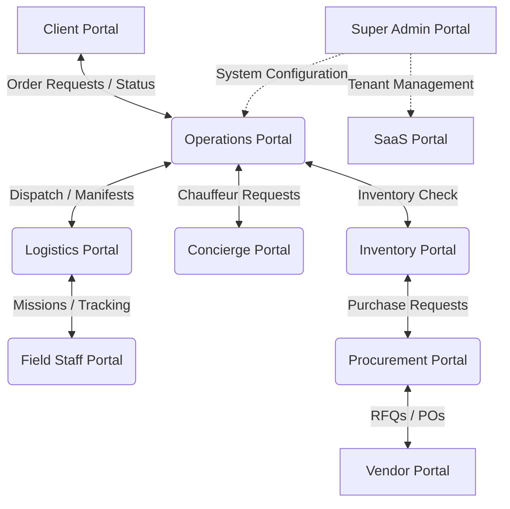

# 02 BUSINESS FLOW MAP

## Portal Interaction Flow

## Module Workflows

### 1. Order to Delivery Flow
**Client** creates Order → **Operations** reviews and approves → **Logistics** schedules Delivery → **Field Staff** assigned Mission → Status updates to `in_transit` → Delivery completed → **Client** confirmation required → `ProofOfDelivery` captured → **Finance** generates Invoice → **Audit Log** records completion.

### 2. Procurement Flow
**Employee/Department** creates `PurchaseRequest` → **Manager** approves → **Procurement** generates `RFQ` → **Vendor** submits `Quotation` → **Procurement** creates `PurchaseOrder` → **Logistics/Warehouse** creates `GRN` (Goods Receipt Note) upon delivery → Inventory is updated.

### 3. Inventory Marketplace Flow
**Vendor** registers items in Marketplace (Tenant Isolation required to separate from Zanezion internal inventory) → **Client** purchases from Marketplace → **Logistics** dispatches from Vendor warehouse.

### 4. Field Staff Assignment Flow
**Operations** creates Mission based on Vehicle & Role constraints → **Field Staff** queue receives Mission → Staff accepts/starts → Live tracking enabled (To Be Implemented) → Mission completed → Payroll calculated.
