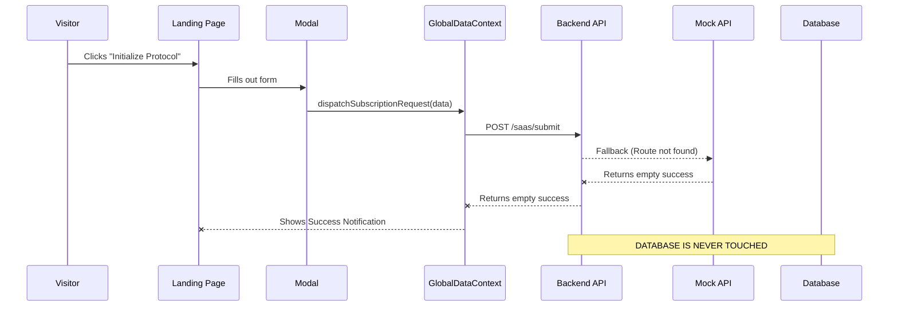

# LANDING PAGE SUBSCRIPTION FLOW AUDIT

## 1. LANDING PAGE ANALYSIS
* **Plans Displayed:** The plans are displayed in the Pricing Section. The details (name, price, yearlyPrice, features) come from the `accessPlans` array fetched via `fetchAccessPlans()` which hits `/api/v1/plans/public` (or mock API).
* **Where defined:** Plans are stored in the database `Plan` model and accessed via the `/plans` endpoint. There are also default plans in `mockApi.js`.
* **Data Collected:** The "Mission Protocol Registry" modal collects: `companyName`, `contactPerson`, `email`, `phone`, `country`, `propertyType`, `throughput`, `addOn`, and `requirements` (plus `assignedAdminId`).
* **Buttons:** "Initialize Protocol" buttons trigger the modal, and the "Dispatch Institutional Request" button submits the form.

## 2. FRONTEND FLOW
**Trace:** Landing Page -> Plan Selection -> Registration -> API Call -> Success Page
* **File path:** `frontend/src/pages/Common/Landing.jsx`
* **Component name:** `Landing`
* **Function name:** `handleRequestSubmit`
* **API endpoint called:** `dispatchSubscriptionRequest()` from `GlobalDataContext.jsx` which sends a `POST` request to `/saas/submit`.
* **Payload sent:** `{ clientName, companyName, plan, contactPerson, email, phone, country, requirements, propertyType, throughput, addOn, assignedAdminId }`

## 3. BACKEND FLOW
**Trace:** API Request -> Route -> Controller -> Service -> Database
* **Route file:** Missing. The route `/saas/submit` does not exist in `backend/src/routes`.
* **Controller file:** Missing. No controller implemented for SaaS requests.
* **Service file:** Missing.
* **Validation layer:** Missing.
* **Database operation:** Missing. The request hits the `app.use` fallback handler in `app.js` which forwards it to `mockApi.js`. `mockApi.js` does not have an entry for `/saas/submit`, so it returns an empty success response `{ success: true, data: [] }`.

## 4. DATABASE FLOW
Currently, **nothing is saved to the database** when the `/saas/submit` API is called because it falls back to the mock API which does nothing.
Based on the `schema.prisma`:
* **User storage location:** `users` table.
* **Plan storage location:** `plans` table.
* **Subscription storage location:** `subscriptions` table.
* **Tenant/Client/Company storage location:** `tenants`, `organizations`, or `clients` tables depending on the exact business requirement (SaaS clients typically map to `clients` or `tenants`).

## 5. CUSTOMER TYPE IDENTIFICATION
Based on current DB schema and naming:
When someone purchases a plan, they are intended to become a **SaaS Client** (or a **Tenant**). The `registerSaaSClient` function in context creates a `Client` with `client_type: "SaaS"`. Wait, the `updateSubscriptionRequest` provisions a "Workspace" indicating they become a **Tenant** with associated **Users**. But `registerSaaSClient` creates a `Client`. There is a discrepancy in how SaaS clients are handled vs generic clients. 

## 6. DASHBOARD ACCESS FLOW
After payment/approval (via `updateSubscriptionRequest`):
* **Account created:** Intended to create a Client or Tenant account and a User account.
* **Who receives the request:** Super Admins or assigned admins.
* **Dashboard updated:** "SaaS Clients" dashboard (`pages/Admin/SaaSClients.jsx`).
* **Permissions:** They would get the `saas_client` or `tenant` admin roles.

## 7. DATA TRAVEL MAP

## 8. MISSING CONNECTIONS
* **Broken links:** `/saas/submit` API does not exist on the backend.
* **Missing API connections:** Backend needs `/saas/submit` route, controller, and service.
* **Missing database writes:** A `SaaSRequest` or `SubscriptionRequest` table needs to be created to hold pending requests, or they need to be saved directly to `clients`/`tenants` with a `pending` status.
* **Missing subscription activation logic:** `updateSubscriptionRequest` calls `/saas/requests/:id/provision`, which also does not exist on the backend.

## 9. FINAL VERDICT
* **A) Who is the user purchasing from landing page?** A potential SaaS Client / Tenant.
* **B) Where is their data stored?** Nowhere currently. It's lost into the void because the backend route is missing.
* **C) Which database tables are affected?** None currently. Should affect `SaaSRequest` (missing), `tenants`, `users`, `subscriptions`.
* **D) Which admin receives the request?** The superadmin should receive it on the SaaS Management dashboard, but the data never reaches the DB.
* **E) What happens immediately after payment?** Currently, the user gets a "Protocol Established" notification, but nothing happens on the backend.
* **F) Is the flow fully connected?** No. It is completely disconnected from the backend and database.
* **G) What is missing?** The backend `/saas/` routes, controllers, services, database models for pending requests, and the provisioning logic to convert a request into a Tenant/Subscription/User.
