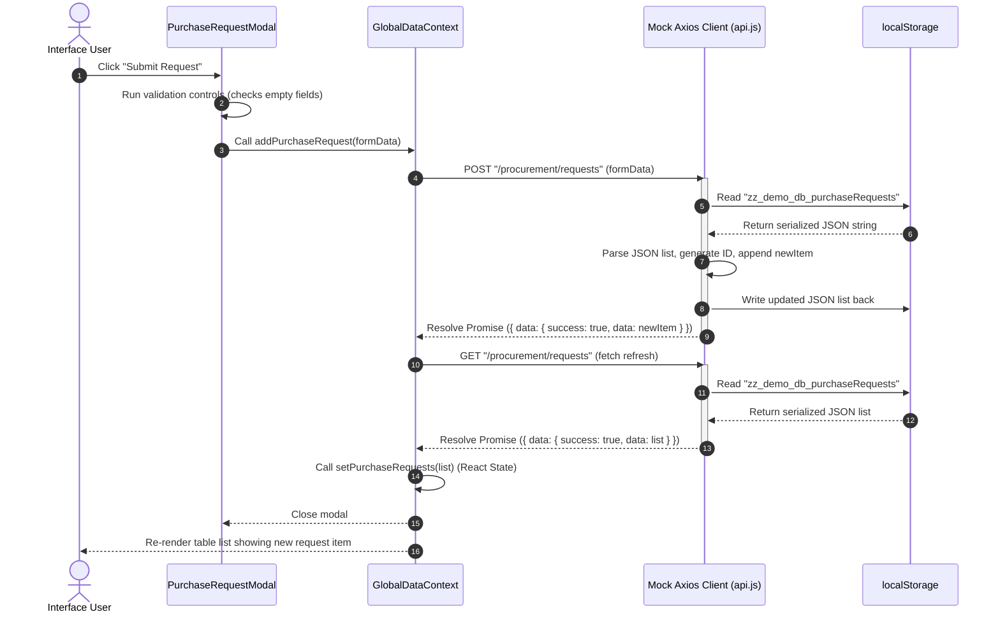

# LocalStorage Data Flow

This document details the layout of persistence keys, flow vectors, and read/write loop mechanics used to simulate database records in the browser.

---

## 1. Browser Storage Registry (Keys & Prefixes)

The application scopes its mock databases inside `localStorage` using distinct prefixes to avoid key collisions.

```
+-------------------------------------------------------------+
|                        localStorage                         |
+-------------------------------------------------------------+
       |
       +--> [Auth state]
       |      |
       |      +-- token : "dummy-token-operations"
       |      +-- userRole : "operations"
       |      +-- userEmail : "operation@example.com"
       |      +-- user : {"id":"dummy-operations", ...}
       |
       +--> [Pricing configurations]
              |
              +-- zz_system_pricing : {"chauffeur_base_price": ...}
              +-- zz_shipping_mode_pricing_v1 : {"Road": 0, "Sea": 150}
       |
       +--> [Simulated database tables]
              |
              +-- zz_demo_db_users : [...]
              +-- zz_demo_db_orders : [...]
              +-- zz_demo_db_inventory : [...]
              +-- zz_demo_db_vehicles : [...]
              +-- zz_demo_db_logs : [...]
              +-- (All remaining 17 tables)
```

---

## 2. Read / Write Loop Flowchart

Below is the execution flow of a typical data write and retrieval loop inside the static interface (e.g. creating a new purchase request):



---

## 3. Data Integrity & Persistence Guarantees

*   **Initialization Guard**: During the initial application import of `api.js`, the script scans for the presence of the `zz_demo_db_users` key. If absent, it automatically populates all 22 collections with high-fidelity mockup presets, ensuring the demo starts with populated tables.
*   **JSON Serialization**: All database operations parse and serialize records in a try-catch sandbox to safeguard against corrupted data structures or full storage quota errors.
*   **Demo Portability**: Clearing the browser cache/cookies or clicking "Log Out" will reset or preserve the local databases depending on the browser settings, allowing users to easily test fresh states.
