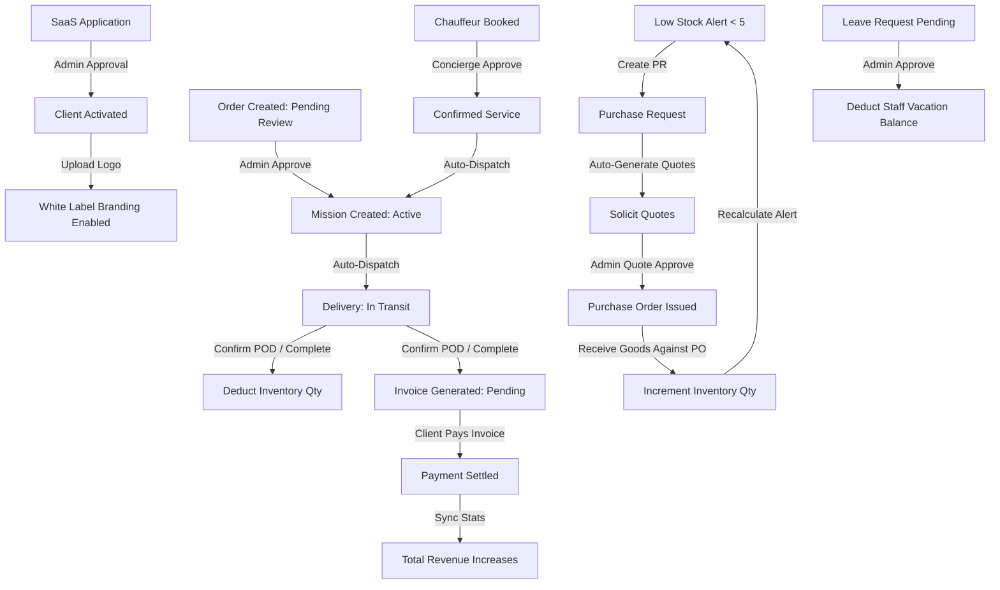

# Relationship Engine Specification

This document maps out the state-machine triggers, data dependencies, and cross-module transitions implemented inside the static demo platform.

---

## 1. Connected Operations & Data Flow Diagram

The platform integrates all modules so that actions in one database table automatically propagate to related logs, invoices, metrics, and inventories.

---

## 2. Dynamic Operational Triggers

Below is the list of triggers executing inside the mock API boundary whenever a mutate request is intercepted:

### A. Order Placement (`POST /orders`)
*   **Trigger**: User checks out.
*   **Decoupled Side Effects**:
    1. Writes to `zz_demo_db_orders`.
    2. Writes an audit log into `zz_demo_db_logs` (e.g. *New order ORD-XXX placed*).
    3. Adds an unread notification into `zz_demo_db_notifications` (*Order Placed*).

### B. Order Approval / Department Routing (`PATCH /orders/:id/status`)
*   **Trigger**: Order status changes to `operation`, `processing`, or `approved`.
*   **Decoupled Side Effects**:
    1. Automatically creates a **Mission** index in `zz_demo_db_missions` with task checkboxes.
    2. Automatically creates a **Delivery** task in `zz_demo_db_deliveries` marked as `In Transit`.
    3. Triggers compliance audit log and panel notifications.

### C. Delivery Completion (`PATCH /orders/:id/status` set to `completed`/`delivered`)
*   **Trigger**: Staff completes assignment.
*   **Decoupled Side Effects**:
    1. Automatically generates an **Invoice** in `zz_demo_db_invoices` for the order amount.
    2. Loops through the order `items` manifest and **decrements** the corresponding quantities inside `zz_demo_db_inventory`.
    3. If any item count drops below 5, automatically triggers a **Critical Stock Level** alert in notifications and sets its status to `Critical`.
    4. Triggers audit logs and completions notice.

### D. Invoice Payment (`PUT /finance/invoices/:id` status set to `Paid`)
*   **Trigger**: Client completes settlement.
*   **Decoupled Side Effects**:
    1. Marks invoice paid.
    2. Dynamic statistics calculations for **Total Revenue** and **Outstanding Accounts Receivable** immediately update.
    3. Adds settlement audit log and notification alerts.

### E. Purchase Request Ingestion (`POST /procurement/requests`)
*   **Trigger**: Stock controller submits PR.
*   **Decoupled Side Effects**:
    1. Creates PR record.
    2. Automatically generates **2 distinct quotes** in `zz_demo_db_quotes` from Caribbean suppliers with competitive pricing ratios.

### F. Quote Approval (`PUT /procurement/quotes/:id` status set to `Approved`)
*   **Trigger**: Procurement lead accepts quote.
*   **Decoupled Side Effects**:
    1. Sets approved quote status, rejects other quotes linked to the same PR.
    2. Advances PR status to `Approved`.
    3. Automatically issues a **Purchase Order (PO)** in `zz_demo_db_purchaseOrders` with vendor references and totals.

### G. Sourced Goods Ingestion (`PUT /procurement/po/:id` status set to `Completed`)
*   **Trigger**: PO received.
*   **Decoupled Side Effects**:
    1. Updates PO status.
    2. Resolves matched item in `zz_demo_db_inventory` and **increments** the stock counts by the PO quantity.
    3. Recalculates thresholds, transitioning critical item badges back to `Stable`.

### H. Employee Leave Approval (`PUT /staff/leave/:id` status set to `Approved`)
*   **Trigger**: HR lead authorizes request.
*   **Decoupled Side Effects**:
    1. Updates leave status.
    2. Automatically locates the employee profile inside `zz_demo_db_users` and **deducts 5 days** from their `vacation_balance` / `vacationBalance`.
