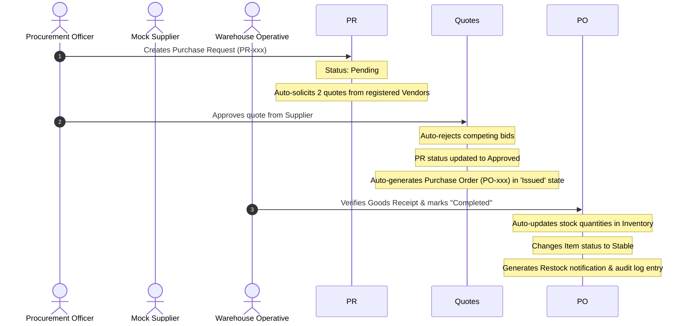

# Zanson Project - User Flow Map

This document maps all screen-to-screen journeys, onboarding processes, connected state transitions, and available actions for each portal screen in the Zanson Project.

---

## 1. System Access & Onboarding Flows

The Zanson platform supports two onboarding vectors: SaaS clients registering workspaces, and tactical/logistics staff registering for clearance.

### A. SaaS Onboarding Flow

```mermaid
graph TD
    A[Guest: Landing Page "/"] -->|Select Plan / Get Started| B[Plans Screen "/plans"]
    B -->|Select Subscription Plan| C[Signup Screen "/signup"]
    C -->|Submit Registration & Details| D[SaaS Registration Pending]
    E[Admin: SaaS Management "/dashboard"] -->|Review & Click Approve| F[Workspace Auto-Provisioned]
    F -->|Activate Client & Generate Key| G[Client Notified & Active]
    G -->|Configures Custom Colors/Logos| H[White Label Portal Access "/dashboard"]
```

*   **Company Registration**: The user registers on the `/signup` screen, choosing their subscription tier (Standard, Executive, or Platinum).
*   **SaaS Approval & Activation**: The submission creates a request in the Global Database. The Admin navigates to SaaS Management, reviews the request, and approves it. This automatically:
    1. Spawns a SaaS client workspace entity.
    2. Instantiates a tenant database schema simulation.
    3. Triggers token-key generation.
*   **Branding & Customization**: Approved clients gain access to the system settings panel to configure branding preferences, which applies custom white-label styles globally.

### B. Staff Clearance Request Flow

```mermaid
graph TD
    A[Guest: Landing Page] -->|Careers/Clearance Link| B[Staff Signup "/staff-signup"]
    B -->|Select Tactical Role & Key| C[Verification Queue]
    D[Admin: User Directory "/dashboard/users"] -->|Verify & Activate Role| E[Credentials Active]
    E -->|Login with clearance| F[Dashboard access based on Role permissions]
```

---

## 2. Connected State Transition Engine (Cross-Module Sync)

The application features a fully reactive frontend relationship engine. Operations in one module automatically cascade downstream through `localStorage` to synchronize all other relevant departments.

### A. Order Fulfillment & Financial Lifecycle

```mermaid
sequenceDiagram
    autonumber
    actor Client
    actor Admin
    actor Logistics
    actor Finance

    Client->>Storefront: Places Order (ORD-xxx)
    Note over Storefront: Status: pending_review (Order Count +1)
    Admin->>Orders: Approves Order
    Note over Orders: Status shifts to 'processing'
    Note over Orders: Auto-spawns Mission (MIS-xxx) & Delivery (DEL-xxx)
    Logistics->>Deliveries: Marks Status as "Delivered"
    Note over Deliveries: Auto-deducts Qty from Inventory
    Note over Deliveries: Checks stock thresholds; if low, spawns alert
    Note over Deliveries: Auto-generates Invoice (INV-xxx) in 'Pending' state
    Finance->>Invoices: Registers Payment Confirmation
    Note over Invoices: Invoice status becomes 'Paid'
    Note over Invoices: Total Revenue statistics & analytics update instantly
```

### B. Procurement & Restocking Lifecycle



---

## 3. Journey Map by Corporate Role

### A. Procurement Role Journey (Supply Chain Loop)
1.  **Dashboard Entry**: Login as `procurement` -> Lands on Procurement Dashboard `/dashboard`.
2.  **Creating Request**: Navigate to `Purchase Requests` -> Click "New Request" -> Fill item specs, quantity, vendor -> Submit. (Triggers quote solicitation).
3.  **Obtaining Quotes**: Request status changes to "Awaiting Bids". Navigate to `Quotes` -> Review incoming vendor bids -> Click "Approve Quote" (Spawns PO).
4.  **Purchase Order Generation**: Approved quote automatically populates in `Purchase Orders` -> Click "Generate PO" -> Save/Print PO document.
5.  **Audit trail**: View logs in `Audit Log` -> Confirm ledger records.

### B. Logistics Role Journey (Fleet & Dispatch Loop)
1.  **Command Center**: Login as `logistics` -> Lands on Logistics Command Center `/dashboard`.
2.  **Dispatching Assets**: Click "Dispatch Vehicle" modal -> Select tactical vehicle (Truck/Ship) -> Select route -> Input driver name, weight cargo, delivery details -> Click "Dispatch".
3.  **Active Missions**: Navigate to `Active Missions` -> Track progress and checklist tasks.
4.  **Route & Map Tracking**: Navigate to `Tracking` or click "Open Logistics Map" -> View real-time simulated progress.
5.  **Deliveries Update**: Navigate to `Deliveries` -> Click "Update Status" to change order state to "In Transit" or "Delivered" (Updates client tracking).

### C. Client / Customer Journey (Marketplace Loop)
1.  **Storefront Access**: Login as `customer` -> Navigate to `Marketplace` (Client Store) -> Browse luxury services/packages.
2.  **Cart & Requisition**: Add products to cart -> Click cart drawer -> Fill delivery specifications -> Click "Checkout" (Spawns client order).
3.  **Order Tracking**: Navigate to `My Orders` -> Click "Track Delivery" -> View order state, delivery coordinates, and expected arrival.
4.  **Chauffeur Reservation**: Navigate to `Chauffeur` -> Select vehicle (Mercedes, SUV, Sprinter) -> Set pickup/drop locations -> Confirm booking.

### D. Concierge Journey (Hospitality Loop)
1.  **Guest Requisition**: Login as `concierge` -> Lands on Concierge Dashboard `/dashboard`.
2.  **Event Scheduler**: Navigate to `Events` -> Click "Schedule Event" -> Input event title, dates, client name, VIP tier -> Submit event calendar.
3.  **Guest requests**: Navigate to `Guest Requests` -> Review guest preferences, dining reservations -> Update task list.
4.  **Luxury items inventory**: Navigate to `Luxury Items` -> Requisition goods from vault.

### E. Corporate Admin Control (HQ Management)
1.  **Staff allocation**: Login as `admin` -> Navigate to `Staff Management` -> Click "Add Personnel" -> Set roles and credentials.
2.  **Security Clearance**: Navigate to `Security Protocol` -> Adjust permissions checkboxes -> Click "Apply Changes".
3.  **Financial oversight**: Navigate to `Intelligence & Revenue` -> Filter timeline (Monthly/Quarterly) -> View Recharts trends -> Click "Audit Export" to download PDF reports.
4.  **Payroll & Leave**: Review absences in `Leave & Absence` -> Approve leave (Deducts vacation balance) -> Process payroll in `Payroll Ledger`.

---

## 4. Screen-to-Screen Click Mapping Reference

| Screen Page | Entry Point | Exit Point Actions | Expected Navigation / Result |
| :--- | :--- | :--- | :--- |
| **Landing** | Domain Root URL | *   Click "Get Started"<br>*   Click "Plans"<br>*   Click "Log In" | *   Goes to `/signup`<br>*   Goes to `/plans`<br>*   Goes to `/login` |
| **Login** | Landing top bar / `/login` | *   Role switch tabs<br>*   Form fields + Submit<br>*   Click "Signup" | *   Loads mock account data<br>*   Auth validation & goes to `/dashboard`<br>*   Goes to `/signup` |
| **Dashboard** | Post-login redirect | *   Sidebar links<br>*   Topbar Profile dropdown<br>*   Rapid-actions buttons | *   Loads respective sub-route<br>*   Navigates to profile/settings or logs out<br>*   Toggles modal or quick state updates |
| **Clients** | Sidebar `/dashboard/clients` | *   "Add Client" button<br>*   Table "View" action | *   Opens client creator modal<br>*   Opens client details slide-over |
| **Reports** | Sidebar `/dashboard/reports` | *   "Filters" toggle<br>*   "Audit Export" button<br>*   "Analyze Multi-temporal" button | *   Toggles CustomDatePicker fields<br>*   Initiates jsPDF audit report download<br>*   Applies date filters & triggers SwAlert |
| **Logistics Dashboard** | Sidebar `/dashboard` (Logistics) | *   "Audit" button<br>*   "Network Map" button<br>*   "Dispatch Vehicle" button<br>*   "Full Arsenal" button | *   Shows sync status popup<br>*   Goes to `/dashboard/logistics-tracking`<br>*   Opens dispatch wizard modal<br>*   Goes to `/dashboard/fleet` |
| **Logistics Routes** | Sidebar `/dashboard/logistics-routes` | *   "Establish Route" button<br>*   "Open Logistics Map" span | *   Opens route builder modal<br>*   Goes to `/dashboard/logistics-tracking` |
| **Client Orders** | Sidebar `/dashboard/client-orders` | *   "Audit Global Network" button<br>*   "Proof of delivery" action | *   Goes to `/dashboard/audits`<br>*   Opens Order Details modal |
